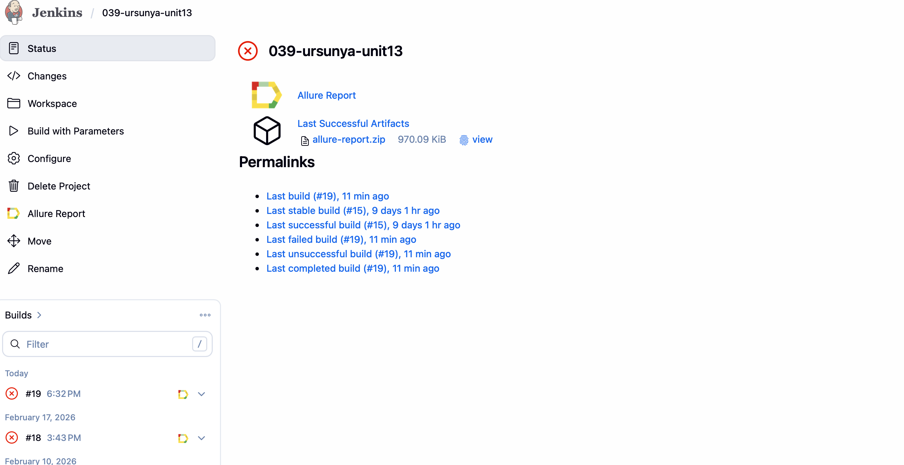
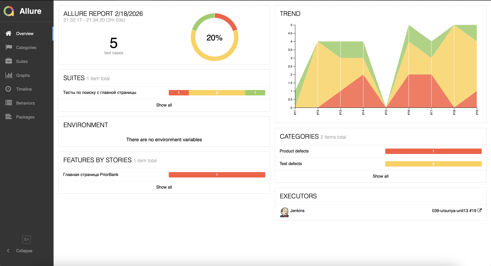
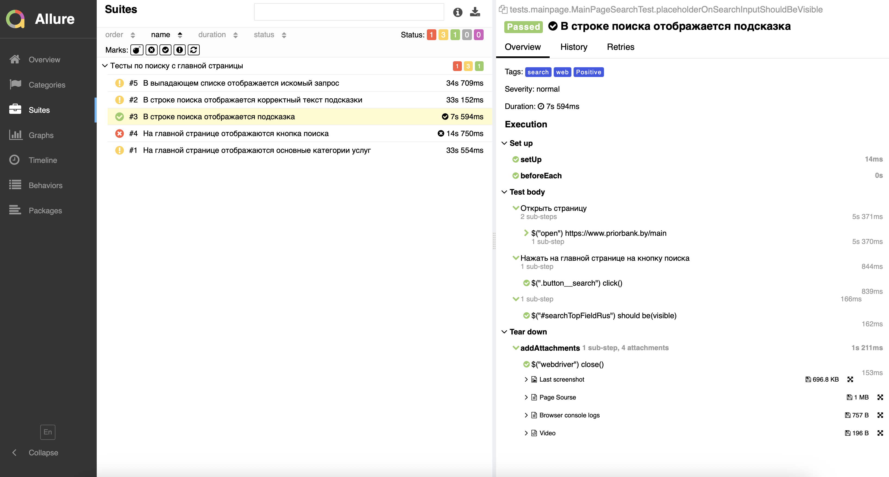
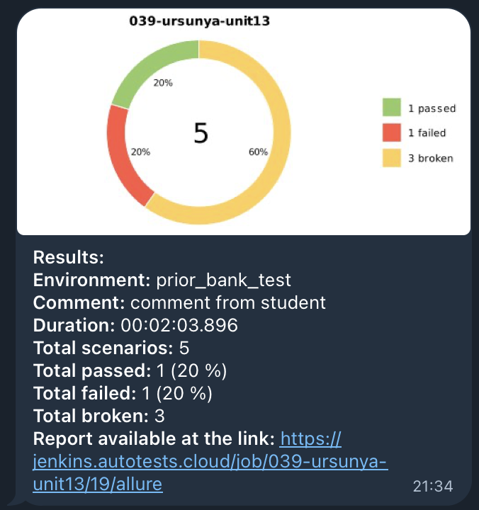

# Проект по автоматизации тестирования для "Приорбанк".

## Содержание

- <a href="#description">Описание</a>
- <a href="#tools">Технологии</a>
- <a href="#jenkins">Сборка в Jenkins</a>
- <a href="#allure">Пример Allure-отчета</a>
- <a href="#telegram">Уведомление в Telegram при помощи бота</a>

## Описание:

Автоматизированные UI-тесты для сайта [priorbank.by](https://www.priorbank.by) с использованием:

- Java 17
- Selenide 7.2.3
- JUnit 5
- Allure Reports

## Технологии:

- В данном проекте автотесты написаны на языке <code>Java</code> с использованием фреймворка для тестирования Selenide.
- В качестве сборщика был использован - <code>Gradle</code>.
- Использованы фреймворки <code>JUnit 5</code> и [Selenide](https://selenide.org/).
- При прогоне тестов браузер запускается в [Selenoid](https://aerokube.com/selenoid/).
- Для удаленного запуска реализована джоба в <code>Jenkins</code> с формированием Allure-отчета и отправкой результатов
  в <code>Telegram</code> при помощи бота.

##  Сборка в Jenkins

##  Пример Allure-отчета

### Результат выполнения теста

##  Уведомления в Telegram с использованием бота

После завершения сборки, бот созданный в <code>Telegram</code>, автоматически обрабатывает и отправляет сообщение с
результатом.

